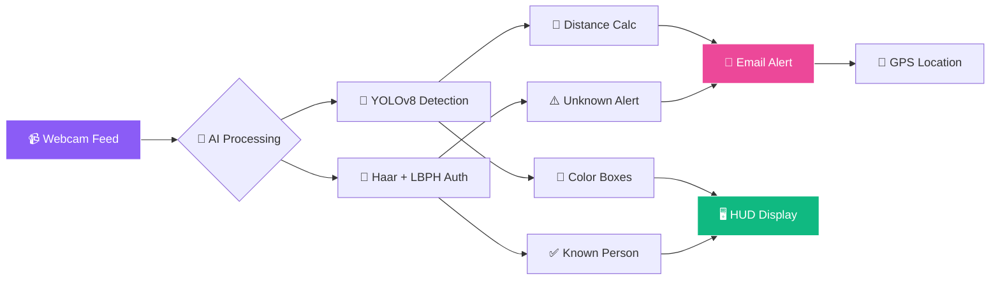

<!-- ═══════════════════════════════════════════════════════════════ -->
<!-- 🎖️ Military Vehicle Detection & Face Auth — Animated README -->
<!-- ═══════════════════════════════════════════════════════════════ -->

<div align="center">
  
</div>

<div align="center">
  <a href="https://git.io/typing-svg">
    
  </a>
</div>

<br/>

<div align="center">
  <a href="https://github.com/sumit966/military-vehicle-detection/stargazers">
    
  </a>
  <a href="https://github.com/sumit966/military-vehicle-detection/network/members">
    
  </a>
  <a href="https://github.com/sumit966/military-vehicle-detection/issues">
    
  </a>
  <a href="https://github.com/sumit966/military-vehicle-detection/commits/main">
    
  </a>
</div>

<br/>

<div align="center">
  
  
  
  
  
  
</div>

<br/>

<div align="center">
  
  
  
  
</div>

<br/>

<div align="center">
  <i>🎓 M.Tech Project · VNIT Nagpur · <b>Sumit Raj</b> (MT24AAI011) · Guide: <b>Prof. Meera Dhabu</b></i>
</div>

<br/>


---

## 📑 Table of Contents

<div align="center">

| 🎯 | 🎯 | 🎯 |
|:---:|:---:|:---:|
| [Overview](#-overview) | [Features](#-features) | [Tech Stack](#️-tech-stack) |
| [Project Structure](#-project-structure) | [Installation](#-installation) | [Requirements](#-requirements) |
| [Configuration](#️-configuration) | [Usage](#-usage) | [Results](#-results) |
| [Dataset](#-dataset) | [Author](#-author) | [License](#-license) |

</div>

---

## 🎯 Overview

<div align="center">
  
</div>

<br/>

Real-time military surveillance system with **two core capabilities**:

<table align="center">
<tr>
<td width="50%" valign="top" align="center">

### 🚗 Military Vehicle Detection


Real-time vehicle detection with **distance estimation** and **automated email alerts**.

</td>
<td width="50%" valign="top" align="center">

### 🔐 Face Authentication


Authenticates personnel and alerts on **unknown persons** via email.

</td>
</tr>
</table>

---

## ✨ Features

<table align="center">
<tr>
<td width="33%" valign="top">

### 🚗 Vehicle Detection

- 🎯 YOLOv8 custom-trained
- 📊 **91.3% mAP** accuracy
- 📏 Distance estimation
- 🔀 IoU overlap filtering
- 📧 Email + GPS alerts
- 🎨 Color-coded boxes

</td>
<td width="33%" valign="top">

### 🔐 Face Authentication

- 📝 User registration (SQLite)
- 👤 Haar Cascade detection
- 🧠 **LBPH 92% accuracy**
- ⚠️ Unknown person alerts
- 🔐 Secure login system
- 📸 Image capture on alert

</td>
<td width="33%" valign="top">

### 🎨 HUD Interface

- 🖥️ Command center GUI
- ✨ Glowing animations
- ⏰ Real-time clock
- 📊 System status
- 🖥️ Full-screen dashboard
- 🎮 Tkinter-based

</td>
</tr>
</table>

---

## 🛠️ Tech Stack

<table align="center">
<tr>
<td><b>Category</b></td>
<td><b>Technology</b></td>
</tr>
<tr>
<td>🐍 Language</td>
<td></td>
</tr>
<tr>
<td>🎯 Object Detection</td>
<td></td>
</tr>
<tr>
<td>🔐 Face Recognition</td>
<td></td>
</tr>
<tr>
<td>👁️ Computer Vision</td>
<td></td>
</tr>
<tr>
<td>🖥️ GUI</td>
<td></td>
</tr>
<tr>
<td>🗄️ Database</td>
<td></td>
</tr>
<tr>
<td>📧 Email</td>
<td></td>
</tr>
<tr>
<td>📍 Location</td>
<td></td>
</tr>
</table>

---

## 🏗️ Architecture



---

## 📁 Project Structure

```
military-vehicle-detection/
├── 🚀 master_system.py              # Main launcher
├── 🖥️ gui_main.py                   # Initial HUD dashboard
├── 🎮 GUI_Master.py                 # Command center GUI
├── 📝 registration.py               # User registration
├── 🔐 login.py                      # Login system
├── 👤 face_registration.py          # Face DB registration
├── 🔒 Face_Authantication.py        # Face auth module
├── 🎯 testing.py                    # Vehicle detection (YOLOv8)
├── 📧 mail.py                       # Email alerts
├── 🧠 model_CNN.py                  # CNN preprocessing
├── 📋 requirements.txt              # Dependencies
└── 📖 README.md                     # This file
```

---

## 🚀 Installation

<div align="center">
  
  
</div>

<br/>

### 1️⃣ Clone the Repository

```bash
git clone https://github.com/sumit966/military-vehicle-detection.git
cd military-vehicle-detection
```

### 2️⃣ Create Virtual Environment (Recommended)

```bash
python -m venv venv
venv\Scripts\activate        # Windows
source venv/bin/activate     # Mac/Linux
```

### 3️⃣ Install Dependencies

```bash
pip install -r requirements.txt
```

**Or install manually:**

```bash
pip install ultralytics opencv-python opencv-contrib-python Pillow numpy pandas scikit-learn requests
```

---

## 📋 Requirements

Create a `requirements.txt` file with:

```txt
ultralytics>=8.0.0
opencv-python>=4.8.0
opencv-contrib-python>=4.8.0
Pillow>=10.0.0
numpy>=1.24.0
pandas>=2.0.0
scikit-learn>=1.3.0
requests>=2.31.0
tkinter
smtplib
sqlite3
```

### Pre-trained Files Needed

<table align="center">
<tr>
<td><b>File</b></td>
<td><b>Purpose</b></td>
<td><b>Where to Get</b></td>
</tr>
<tr>
<td><code>best.pt</code></td>
<td>YOLOv8 trained model</td>
<td>Train with custom dataset</td>
</tr>
<tr>
<td><code>haarcascade_frontalface_default.xml</code></td>
<td>Face detector</td>
<td>OpenCV GitHub</td>
</tr>
<tr>
<td><code>trainingData.yml</code></td>
<td>LBPH face trainer</td>
<td>Generated by <code>face_registration.py</code></td>
</tr>
</table>

---

## ⚙️ Configuration

### 📧 Email Settings (`testing.py`)

Open `testing.py` and update:

```python
SENDER_EMAIL = "your_email@gmail.com"
RECEIVER_EMAIL = "your_email@gmail.com"
PASSWORD = "your_app_password"        # Use Gmail App Password, NOT login password
SMTP_SERVER = "smtp.gmail.com"
SMTP_PORT = 587
```

**🔑 How to get Gmail App Password:**

1. Go to Google Account → Security
2. Enable 2-Step Verification
3. Go to App Passwords
4. Generate password for "Mail"
5. Copy 16-character password into `PASSWORD`

### 📍 GPS Location Settings

```python
IPSTACK_API_KEY = "your_ipstack_api_key"   # Get free key from ipstack.com
```

### 🔐 Face Recognition Threshold (`Face_Authantication.py`)

```python
CONFIDENCE_THRESHOLD = 70    # Lower = stricter matching
```

---

## 🎮 Usage

### 🚀 Run the Main System

```bash
python master_system.py
```

### 📋 Step-by-Step Workflow

<table align="center">
<tr>
<td width="50%" valign="top">

**1️⃣ Register a User**
- Open the app → Click "Register"
- Enter username + password
- Credentials saved to SQLite

**2️⃣ Login**
- Enter credentials
- Access main dashboard

**3️⃣ Face Registration (First Time)**
- Go to "Face Registration"
- Capture 30+ images per person
- LBPH model auto-trains → `trainingData.yml`

</td>
<td width="50%" valign="top">

**4️⃣ Vehicle Detection**
- Click "Vehicle Detection"
- Real-time YOLOv8 detection on webcam
- Alerts auto-sent on detection

**5️⃣ Face Authentication**
- Click "Face Authentication"
- Live webcam feed
- Unknown faces → email alert with image

</td>
</tr>
</table>

---

## 📊 Results

<div align="center">
  
  
  
  
  
</div>

<br/>

### 📈 Benchmark Metrics

| Metric | Value |
|--------|-------|
| 🎯 Vehicle Detection mAP | **91.3%** |
| 🔐 Face Recognition Accuracy | **92%** |
| ⚡ Processing Speed | **25.9 FPS** |
| 📧 Alert Latency | **< 2 seconds** |
| ⚠️ False Positive Rate | **4.2%** |

### 🖥️ Sample Output

```bash
[INFO] Loading YOLOv8 model... ✓
[INFO] Loading Haar Cascade... ✓
[INFO] Starting camera feed...
[DETECT] Military tank detected - Confidence: 0.94
[ALERT] Email sent to admin with GPS: 18.5204°N, 73.8567°E
[FACE] Unknown person detected - Confidence: 45.2 (threshold: 70)
```

---

## 📊 Dataset

<table align="center">
<tr>
<td width="50%" valign="top">

### 🚗 Vehicle Detection Dataset

- 📚 **Source:** Custom annotated military vehicle images
- 🎯 **Classes:** Tank, Military Truck, Armored Vehicle, Soldier
- 📸 **Images:** 2,000+ annotated images
- 📝 **Format:** YOLO format (`.txt` labels)
- 🔀 **Split:** 80% train / 10% val / 10% test

</td>
<td width="50%" valign="top">

### 👤 Face Dataset

- 📚 **Source:** Custom webcam captures
- 📸 **Images per person:** 30-50
- 🎨 **Format:** Grayscale 200x200 px
- 📁 **Storage:** `facesData/` folder

</td>
</tr>
</table>

---

## 🧪 Testing

```bash
# 🚗 Test vehicle detection only
python testing.py

# 🔐 Test face auth only
python Face_Authantication.py

# 🚀 Run full system
python master_system.py
```

---

## 🐛 Troubleshooting

| Issue | Solution |
|-------|----------|
| 📷 Camera not opening | Check if other apps are using webcam |
| 📧 Email not sending | Use Gmail App Password, not login password |
| 🎯 Model not loading | Ensure `best.pt` is in root folder |
| 👤 Face not recognized | Re-register with more images (50+) |
| ⚠️ OpenCV error | Reinstall: `pip install --force-reinstall opencv-python` |

---

## 👤 Author

<div align="center">


<br/><br/>

<b>M.Tech Applied AI & ML · VNIT Nagpur</b>

<br/><br/>

<a href="https://sumit966-github-io.vercel.app">
  
</a>
<a href="https://www.linkedin.com/in/er-sumit-raj-/">
  
</a>
<a href="https://github.com/sumit966">
  
</a>
<a href="mailto:info.sr0909@gmail.com">
  
</a>

<br/><br/>

<i>🎓 Guide: <b>Prof. Meera Dhabu</b>, VNIT Nagpur</i>

</div>

---

## 🙏 Acknowledgements

<div align="center">

<a href="https://github.com/ultralytics/ultralytics">
  
</a>
<a href="https://opencv.org/">
  
</a>
<a href="https://vnit.ac.in/">
  
</a>

</div>

---

## 📄 License

<div align="center">


<br/>


<br/><br/>

<samp>
This project is for <b>academic evaluation purposes only</b>.<br/>
Not for commercial or military use without proper authorization.
</samp>

<br/><br/>

<sub><samp>© 2024 &nbsp;·&nbsp; SUMIT RAJ &nbsp;·&nbsp; VNIT NAGPUR</samp></sub>

<br/>


</div>

<br/>


